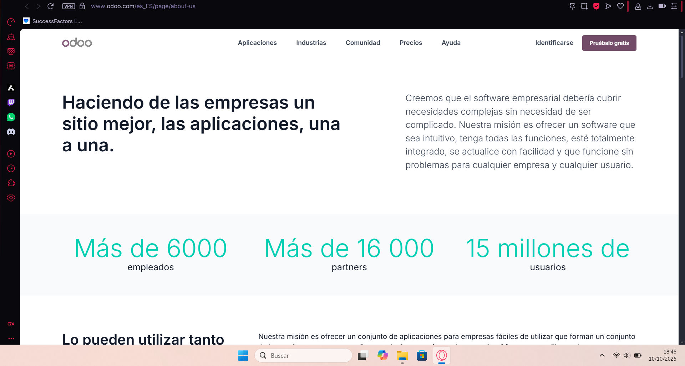

# <ins>Comparativas ERP</ins>

 

## <ins>Índice</ins>

1. Análisis de los ERPs elegidos
2. Casos en los que elegirías esos ERPs
3. Tabla comparativa por criterios
4. Conclusiones para el caso concreto (elección y motivos)
5. Fuentes y evidencias (links a documentación oficial y capturas)

## <ins>Análisis de los ERPs elegidos</ins>

En este apartado se presentan las tres soluciones ERP seleccionadas: 

- Microsoft Dynamics 365 Business Central
- Odoo
- Netsuite

Se analizarán sus principales características, qué procesos cubren, sus ventajas y limitaciones, para determinar cuál se adapta mejor a las necesidades de GreenGym Solutions.

### Microsoft Dynamics 365 Business Central

Microsoft Dynamics 365 Business Central es un software de gestión empresarial (ERP) diseñado para organizaciones pequeñas y medianas que permite agilizar y optimizar los procesos administrativos, financieros, de ventas, servicios y operaciones desde una única plataforma. Es una solución fácil de usar, modulable y personalizable que ayuda a las empresas a racionalizar sus procesos, mejorar la relación con sus clientes y tomar decisiones mejor informadas, pudiendo añadir funcionalidades específicas para su sector o región mediante aplicaciones de ISV líderes. Gracias a la inteligencia artificial, el aprendizaje automático, el IoT y la realidad mixta, Business Central impulsa la innovación y el crecimiento empresarial, todo ello integrado en la nube de Microsoft.

### Procesos que cubre 

- Gestión financiera, contabilidad, facturación y cobros.

- Control de inventario y compras.

- Reporting y BI integrados.

- Soporte y seguridad empresarial.

- Capacidad para ampliar con módulos y extensiones.

- En planes recientes, se agrega funcionalidad de Copilot para inteligencia integrada en tareas de finanzas, atención y operaciones. 

### Ventajas

- Mayor trazabilidad: cada movimiento o transacción queda registrado, lo que mejora la transparencia y el control interno.

- Ecosistema todo en uno: al integrar todas las herramientas dentro de Dynamics 365, se evita el uso de múltiples aplicaciones y se centraliza la gestión del negocio en una única plataforma

- Alta seguridad y cumplimiento: al ser un servicio gestionado por Microsoft, ofrece copias de seguridad automáticas, cifrado de datos...

- Plataforma escalable: permite comenzar con módulos básicos (por ejemplo, finanzas o ventas) y ampliar progresivamente según crecen las necesidades del negocio.

- Datos actualizados en tiempo real.

- Mejora de la experiencia del cliente: la automatización de procesos y la personalización del servicio facilitan una atención más rápida y eficiente.

### Limitaciones

- Microsoft Dynamics 365 Business Central no incluye herramientas para reservas de clases colectivas, control de asistencias a eventos o gestión de entrenadores, por lo que habría que añadir módulos externos.

- Cada persona que use el sistema necesitaría una licencia, lo que puede aumentar el coste si muchos empleados tienen que acceder.

- Está pensado para empresas en general, así que hay que configurarlo un poco para ajustarlo a las necesidades concretas de un gimnasio.

### Odoo

Odoo es una solución ERP de código abierto que agrupa en una sola plataforma todas las aplicaciones necesarias para gestionar una empresa. Desde la contabilidad hasta la logística, desde la atención al cliente hasta el comercio electrónico, pasando por CRM, RRHH, producción o BI. Es muy usada por pymes por su flexibilidad y amplio ecosistema de apps, su interfaz intuitiva y su capacidad de personalización hacen que sea fácil de usar y adaptar a las necesidades específicas de cada negocio.

### Procesos que cubre 

- Ventas, CRM y atención al cliente.

- Inventario y gestión de almacén.

- Punto de venta (POS) conectado con stock.

- Contabilidad y facturación.

- Compras, proyectos y marketing digital.

- Módulos de suscripciones o membresías

### Ventajas

- Reducción de costes: Al centralizar toda la gestión en una sola plataforma, se reducen los costos operativos y de licencias de software.

- Optimización de procesos: Facilita la automatización de tareas repetitivas.

- Datos actualizados en tiempo real.

- Gran flexibilidad modular: se pueden activar o desactivar aplicaciones según necesidad, lo que permite que Odoo se adapte a las necesidades específicas de cada negocio.

- Comunidad activa y miles de módulos externos disponibles.

- Escalabilidad: Odoo crece junto con la empresa, permitiendo la adición de nuevos módulos según sea necesario.

- Accesible desde cualquier dispositivo (web o app móvil).

- Disponible en versión gratuita (Community) y de pago (Enterprise).

### Limitaciones

- La versión Community no incluye todas las funciones avanzadas.

- Requiere configuración y mantenimiento técnico para entornos personalizados.

- Puede necesitar servidores externos si se instala en local.

### Netsuite

Oracle NetSuite es un ERP en la nube que permite gestionar todos los procesos de un negocio desde una sola plataforma. Integra finanzas, inventario, ventas, compras, recursos humanos y CRM, ofreciendo una visión global en tiempo real. Su modelo cloud elimina la necesidad de servidores locales y facilita el acceso desde cualquier lugar, ideal para pymes que buscan automatizar procesos y centralizar su gestión.

### Procesos que cubre 

- Gestión financiera, contabilidad y presupuestos.

- Facturación, cobros y pagos.

- Compras, ventas e inventario.

- Gestión de clientes (CRM) y marketing.

- Recursos humanos y nóminas.

- Analítica avanzada y cuadros de mando.

- Multiempresa y multimoneda.

### Ventajas

- Amplia automatización: reduce tareas manuales y errores humanos.

- Todo en la nube: accesible desde cualquier lugar sin necesidad de infraestructura local.

- Agregar rápida y fácilmente funcionalidades a medida de tu negocio.

- Informes en tiempo real: ofrece dashboards personalizables con indicadores clave.

- Soporte global y respaldo de Oracle: garantiza estabilidad, seguridad y actualizaciones continuas.

### Limitaciones

- Coste elevado: suele ser más caro que otras soluciones ERP, lo que puede ser una barrera para pymes pequeñas.

- Curva de aprendizaje: requiere formación inicial para aprovechar todas sus funciones.

- Su enfoque global y multisectorial puede dejar de lado las necesidades específicas de negocios locales.

- Orientado a empresas medianas/grandes: puede ser demasiado complejo para negocios con pocos procesos.

- Menor personalización directa: al ser un sistema cerrado, depende de consultores certificados para adaptaciones.

## <ins>Casos en los que elegirías esos ERPs</ins>

| ERP | Caso |
| :---: | :---: |
| **Microsoft Dynamics 365** | Para empresas medianas que ya usan el ecosistema de Microsoft 365 (Teams, Outlook, Excel, Power BI) y necesitan una gestión financiera sólida, control de inventario y análisis de datos integrados |
| **Odoo** | Para pymes que necesitan una solución flexible, económica y modular para centralizar clientes, reservas, ventas y stock en una sola plataforma. Su módulo de membresías, POS y reservas lo hacen ideal para gimnasios o centros deportivos y su versión en la nube o local se adapta a cualquier presupuesto |
| **Netsuite** | Para empresas medianas o grandes con expansión internacional o varias unidades de negocio. Es la mejor opción para crecimientos rápidos, con apertura de nuevas sedes o si se tiene la necesidad de un control financiero global, multiempresa y multimoneda, aunque su coste y complejidad lo hacen menos idóneo |

## <ins>Tabla comparativa por criterios</ins>

## Tabla comparativa por criterios

| Criterios | Odoo | Microsoft Dynamics 365 Business Central | Oracle NetSuite |
|:---:|:---:|:---:|:---:|
| **Modelo de despliegue** | Nube (Odoo Online, Odoo.sh) y local (on-premise) | Nube / híbrido / local | 100 % nube |
| **Facilidad de uso** | Interfaz amigable, curva de aprendizaje baja-media | Interfaz profesional, curva de aprendizaje media | Interfaz robusta, curva de aprendizaje mayor|
| **Personalización e integración** | Muy alta: módulos, API abierta, comunidad extensa | Alta: API, conectores Microsoft, extensiones | Buena: permite integraciones, pero depende de SuiteCloud y consultores |
| **Seguridad y cumplimiento** | Buenas opciones de hosting, cumplimiento RGPD, backups según proveedor | Muy alta: estándares Microsoft, residencia de datos, permisos y roles fuertes | Alto nivel de seguridad, cumplimiento normativo, cifrado y estándares empresariales |
| **Cobertura funcional por procesos** | Ventas, CRM, POS, inventario, compras, facturación, suscripciones, reservas | Finanzas, compras, ventas, inventario, reporting, control de presupuestos | Finanzas, CRM, inventario, RR.HH, compras, BI, operaciones globales |
| **Ecosistema y soporte** | Comunidad global activa, muchos módulos externos, partners locales | Red de partners Microsoft, soporte oficial, gran ecosistema empresarial | Oracle como proveedor grande, soporte global, partners especializados |
| **Coste total estimado (TCO)** | Bajo-medio: opción gratuita / de bajo coste + costo de hosting o partner si se personaliza | Medio-alto: licencias por usuario, costes de implementación, support | Alto: suscripción, implementación, formación y mantenimiento continuo |
| **Escalabilidad** | Alta: multiusuario, se puede crecer con módulos, multiempresa posible | Muy alta: preparado para empresa en crecimiento con muchas sedes, usuarios y negocios paralelos | Muy alta: pensado para expansión, operaciones internacionales, multiempresa/multimoneda |

## <ins>Conclusiones para el caso concreto (elección y motivos)</ins>

Después de comparar las tres soluciones ERP seleccionadas: Odoo, Microsoft Dynamics 365 Business Central y Oracle NetSuite. He elegido ***Odoo*** como la opción más adecuada para GreenGym Solutions, ya que ofrece una solución completa, flexible y económica adaptada a las necesidades de una pyme del sector servicios.

Odoo permite gestionar desde un único sistema todos los procesos del gimnasio: clientes, reservas, membresías, ventas..., todo con una interfaz sencilla y accesible desde la nube. Además, su enfoque modular facilita que se empiece con lo básico e ir incorporando nuevas funciones a medida que el negocio vaya creciendo.

A diferencia de otras opciones más costosas o complejas, Odoo combina el bajo coste de implantación con una alta capacidad de personalización y una comunidad activa, lo que lo convierte en la mejor elección para digitalizar y ordenar la gestión del gimnasio sin grandes inversiones.

## <ins>Fuentes y evidencias</ins>

Microsoft Dynamics 365 Business Central

https://www.prodwaregroup.com/es-es/soluciones/microsoft-dynamics-365/microsoft-dynamics-365-business-central/?utm_source=adwords&utm_medium=paid&utm_campaign=unificada&utm_term=businesscentral&utm_content=landing&gad_source=1

https://learn.microsoft.com/en-us/dynamics365/business-central/welcome

https://aglaia.es/blog/dynamics-365/microsoft-dynamics-365

https://www.softwareadvice.com/accounting/dynamics-365-business-central-profile

https://www.youtube.com/watch?v=fpu_Z8ZZLvg

 

Odoo

https://www.odoo.com/documentation/18.0

https://www.odoo.com/es_ES/page/about-us

https://nanobytes.es/odoo-erp

https://kaizenstep.com/categoria-erp/ventajas-y-desventajas-de-odoo

 

Netsuite

https://www.netsuite.com.mx/portal/mx/resource/articles/erp/what-is-netsuite.shtml

https://entersol.com.mx/netsuite-caracteristicas

https://www.softwareadvice.com/accounting/netsuite-financials-accounting-software-profile

 

Otros

https://docs.github.com/es/get-started/writing-on-github/working-with-advanced-formatting/organizing-information-with-tables

https://docs.github.com/es/get-started/writing-on-github/working-with-advanced-formatting/organizing-information-with-tables

https://www.canva.com

https://gemini.google.com/u/0/app/82aaa5a7fe321977

 

